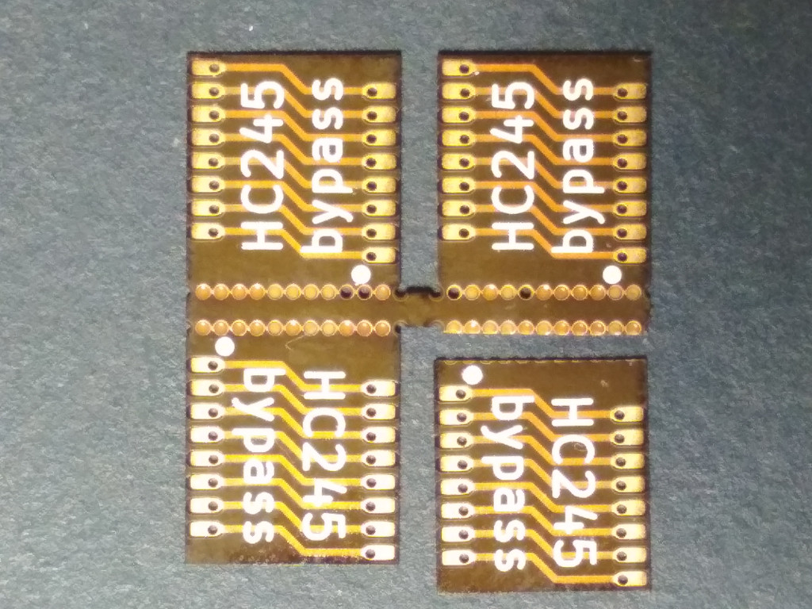
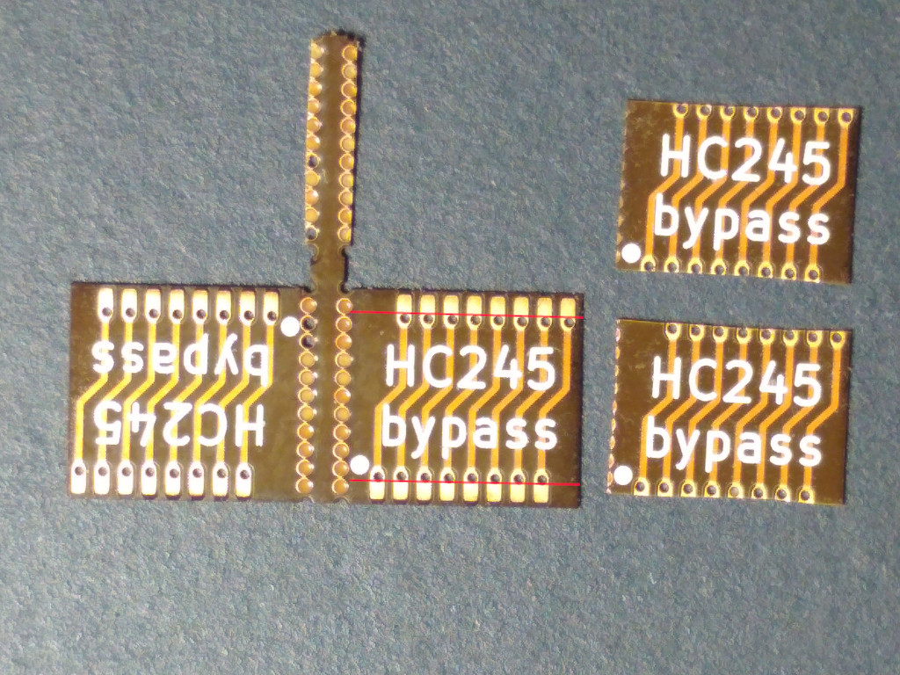

# `hc245t-bypass`

This tiny board is useful to replace 74HC245T chips on Colorlight 5A-75B and 5A-75E boards.

You can order these boards from OSH Park: https://oshpark.com/shared_projects/Og8YtGBU

## Rework

The board needs some rework to improve solderability. It's also possible to solder it "as is", but you can encounter shorts between the adjacent pins.

First, separate the boards from a panel. This can be done easily with scissors.

Next, cut each board by the line marked in red. The line should be on the edge of each via, not on the center. Try to make the line as straight as possible. The idea is to cut as much copper as possible, avoiding cutting most of the via copper.

Now you're done! Enjoy soldering!
